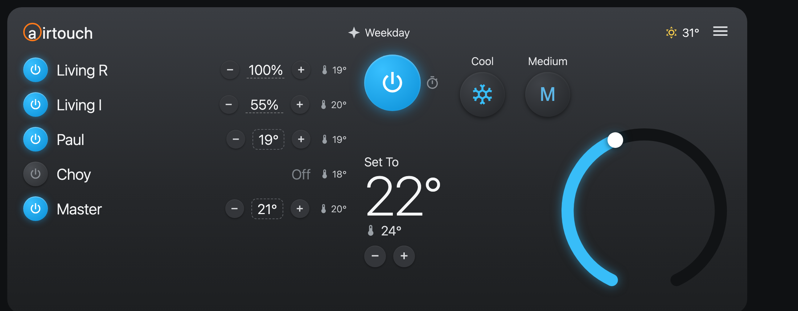

# AirTouch Panel

A Lovelace custom card for Home Assistant that mimics the look of the
**Polyaire AirTouch 5** wall controller — a zone list on the left and the
AC-unit control (mode, fan, setpoint and a draggable dial) on the right.

Built as a single vanilla-JS web component: no build step, no runtime
dependencies (it uses Home Assistant's built-in `<ha-icon>`).

> Not affiliated with, or endorsed by, Polyaire / AirTouch. "AirTouch" is used
> only to describe the interface this card resembles.



Run `preview.html` (see [Development](#development)) for a no-Home-Assistant
mock render of the card.

## Install

### HACS (custom repository)

1. HACS → top-right menu → **Custom repositories**
2. Repository: `pwillia6/airtouch-panel` — Type: **Dashboard** → **Add**
3. Find **AirTouch Panel** in the HACS list → **Download**
4. If the resource isn't added automatically, add it under
   **Settings → Dashboards → ⋮ → Resources**:
   - URL: `/hacsfiles/airtouch-panel/airtouch-panel.js`
   - Type: **JavaScript module**
5. Reload the browser (Ctrl/Cmd-F5).

### Manual

1. Copy `airtouch-panel.js` to `<config>/www/airtouch-panel.js`
2. Add a resource: URL `/local/airtouch-panel.js`, type **JavaScript module**
3. Reload the browser.

## Usage

```yaml
type: custom:airtouch-panel
unit: climate.ac_0
outside_temp: sensor.outdoor_meter_temperature
schedule_name: Weekday
zones:
  - { name: Living R, climate: climate.living_r,    damper: cover.living_r_damper,    control: damper }
  - { name: Living I, climate: climate.living_i,    damper: cover.living_i_damper,    control: damper }
  - { name: Paul,     climate: climate.paul_s_room, damper: cover.paul_s_room_damper, control: temp }
  - { name: Choy,     climate: climate.choy_room,   damper: cover.choy_room_damper,   control: damper }
  - { name: Master,   climate: climate.master_bed,  damper: cover.master_bed_damper,  control: temp }
```

### Options

| Key             | Required | Default     | Description |
|-----------------|----------|-------------|-------------|
| `unit`          | yes      | –           | The AC unit `climate.*` entity (mode, fan, target/current temp, dial). |
| `zones`         | yes      | `[]`        | List of zone rows (see below). |
| `outside_temp`  | no       | –           | Any entity whose state is a temperature; shown top-right. Hidden if unset. |
| `schedule_name` | no       | `Weekday`   | Static text shown in the top bar next to the star icon. |

### Zone options

| Key       | Required | Default  | Description |
|-----------|----------|----------|-------------|
| `name`    | yes      | –        | Row label. |
| `climate` | yes      | –        | The zone `climate.*` entity. Drives the power toggle and the room-temp readout; also the setpoint when `control: temp`. |
| `damper`  | when `control: damper` | – | The zone's `cover.*` damper entity. Drives the `− NN% +` control. |
| `control` | no       | `damper` | The row's *initial* control: `damper` → damper % (5% steps), `temp` → zone setpoint (uses the climate entity's `target_temp_step`). Tap the value on the card to switch between the two at runtime (like tapping the figure on the real panel); this also flips the console's zone control method. Omit `damper` to lock the row to `temp`. |

## Entity mapping (Home Assistant `airtouch5` integration)

- **Unit** — `climate.<name>` exposes `hvac_modes`, `fan_modes`
  (`low`/`medium`/`high`/`auto`/`intelligent_auto`), `temperature` and
  `current_temperature`. The card cycles modes/fan on tap and sets the target
  temperature from the dial and the `− +` steppers.
- **Zone power** — `climate.turn_on` / `climate.turn_off` on the zone entity
  (on = `fan_only`).
- **Zone damper %** — `cover.<zone>_damper` `current_position` /
  `cover.set_cover_position`.
- **Zone setpoint** — `climate.<zone>` `temperature` /
  `climate.set_temperature` (only meaningful for ITC zones).
- **Boost** — a `B` chip shows when the zone's `preset_mode` is `boost`.

## Development

```bash
# serve the repo and open the preview (mock hass, ha-icon stubbed)
python3 -m http.server 8777
open http://localhost:8777/preview.html
```

## License

MIT — see [LICENSE](LICENSE).
